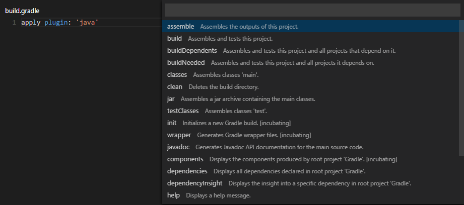

# No Longer Being Maintanined
Please go to [badsyntax/vscode-gradle](https://github.com/badsyntax/vscode-gradle) for further updates

# VSCode-Gradle
This extension provides support to run _gradle_ tasks.

